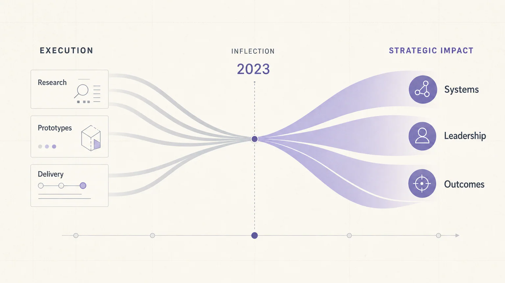

# Zyncli Template Skills

[](https://github.com/hahayang888/zyncli-template/actions/workflows/validate.yml)
[](LICENSE)

Open-source visual Skills for turning articles, blogs, newsletters, essays, and social posts into coherent illustration sets.

[Zyncli](https://zyncli.com) is a visual Skill platform for article illustration. Instead of asking an image model to make a series of disconnected pictures, each Zyncli template gives an AI agent a reusable visual system: how to understand the writing, which ideas deserve an image, how to compose each scene, and how to keep the complete set visually consistent.

This repository contains the open-source versions of the templates available through the [Zyncli template library](https://zyncli.com/templates). Every template is packaged as an independently installable Agent Skill.

## What a visual Skill does

A Zyncli Skill guides an agent through the complete illustration workflow:

1. Read the article and identify its central argument, contrasts, turning points, systems, and conclusion.
2. Select the moments that genuinely benefit from an illustration instead of decorating every paragraph.
3. Build a shot plan with one clear idea and a distinct composition for every image.
4. Apply the template's visual DNA, palette, medium, metaphor system, and negative constraints.
5. Generate each illustration with the image-generation tool available to the agent.
6. Review the result for semantic accuracy, style consistency, repetition, anatomy, typography, and production quality.

These are more than reusable prompts. Each Skill combines editorial reasoning with a repeatable visual direction and a QA workflow.

## Example styles

The current library includes editorial illustration, documentary photography, 3D systems, data graphics, collage, abstract geometry, workplace scenes, ink drawing, and other visual directions.

| Strategic Convergence | Documentary Work |
| --- | --- |
| [](skills/strategic-convergence) | [](skills/documentary-work) |
| Editorial data graphics for strategy, transformation, and leadership. | Naturalistic workplace photography built around credible human actions. |

| Soft Systems 3D | Cutout Editorial Collage |
| --- | --- |
| [](skills/soft-systems-3d) | [](skills/cutout-editorial-collage) |
| Tactile 3D systems for approachable product and workflow stories. | Layered paper collage for culture, media, strategy, and technology essays. |

The images above are representative outputs generated from the corresponding Skill directions. Each Skill includes three example images for visual calibration.

## What is inside each Skill

```text
skills/
└── documentary-work/
    ├── SKILL.md
    ├── agents/
    │   └── openai.yaml
    ├── references/
    │   └── style-guide.md
    └── assets/
        └── examples/
            ├── 01.webp
            ├── 02.webp
            └── 03.webp
```

- `SKILL.md` contains the article analysis, shot-planning, generation, iteration, and delivery workflow.
- `references/style-guide.md` defines the visual DNA, palette, composition patterns, metaphor rules, must-have qualities, forbidden patterns, and QA rubric.
- `assets/examples/` provides low-frequency visual calibration without asking the agent to copy a specific composition.
- `agents/openai.yaml` provides the display metadata used by compatible agent interfaces.

The Skills are provider-agnostic. They do not contain model credentials or depend on a specific image API. Use them with an agent that supports Agent Skills and has access to an image-generation tool.

## Install

List every available Skill:

```bash
npx skills add hahayang888/zyncli-template --list
```

Install one Skill globally:

```bash
npx skills add hahayang888/zyncli-template --skill documentary-work -g
```

Install several Skills:

```bash
npx skills add hahayang888/zyncli-template \
  --skill documentary-work \
  --skill glass-systems \
  --skill strategic-convergence \
  -g
```

Install the complete library:

```bash
npx skills add hahayang888/zyncli-template --skill '*' -g
```

The open [`skills` CLI](https://github.com/vercel-labs/skills) supports Codex, Claude Code, Cursor, GitHub Copilot, and many other agents. Consult its documentation for agent-specific paths and installation options.

## Use

After installation, provide the article and ask your agent to use the Skill by name:

```text
Use $documentary-work to plan and generate four illustrations for this article.
Show me the shot plan before generating the images.
```

For a diagram-led article:

```text
Use $strategic-convergence to turn this strategy essay into a coherent
three-image visual set. Keep labels short and use only facts from the article.
```

Every Skill is designed to plan the complete set before generating individual images. Reviewing the shot plan first is recommended when factual accuracy, brand safety, or generation cost matters.

## Browse the library

See [CATALOG.md](CATALOG.md) for the complete catalog, including each Skill's category, medium, and best-fit content.

Current directions include:

- Editorial and conceptual illustration
- Photography and realistic workplace scenes
- 3D objects, characters, and systems
- Infographics and explanatory diagrams
- Collage, print, paper, ink, and charcoal
- Technology, business, culture, education, and personal essays

## Continuously updated with Zyncli

This repository will grow alongside the template library on [zyncli.com](https://zyncli.com/templates). When a new website template reaches production quality, its corresponding open-source Skill will be added here with its workflow, style guide, and visual examples.

That means the public library is not a fixed release or a one-time prompt collection. New styles, improved QA rules, and refinements from real generation results will continue to be published over time.

Watch or star the repository if you want to follow new template releases.

## Zyncli and this repository

The open-source Skills are useful when you want to run a template directly inside your own agent workflow.

[Zyncli](https://zyncli.com) adds the hosted product experience around them: article planning, template discovery, private reusable brand Skills, reference management, image generation, project history, and production delivery.

## Contributing

Bug reports and focused improvements are welcome. Read [CONTRIBUTING.md](CONTRIBUTING.md) before changing a Skill, and keep its workflow, style guide, examples, and agent metadata aligned.

All Skills are automatically validated on every push.

## License

The template Skills are released under the [MIT License](LICENSE). The Zyncli name and logo are not licensed as part of the templates.
